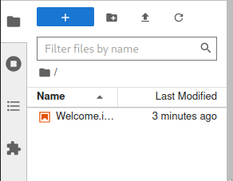

# Course Material For ASC 2024

## Running the notebooks

You can run the notebooks using [Docker](#using-docker), [Binder](#using-binder) or [Anaconda](#using-anaconda).

### Using Docker

#### Installing Docker

Follow the guides for your operating system:

- [Windows](https://docs.docker.com/desktop/install/windows-install/)
- [Mac](https://docs.docker.com/desktop/install/mac-install/)
- [Linux](https://docs.docker.com/desktop/linux/)

#### Running the Docker container

In the terminal window, first create and change into a working directory (e.g. `gpn455_eqseis_notebooks`)

```console
$ mkdir asc2024course
$ cd asc2024course
```

then run the following `docker run` command.

```console
$ docker run -v ${PWD}:/home/scoped/work --rm -p 8888:8888 --entrypoint /bin/init rdno/asc2024:latest
```

Command Explanation:
- `docker run` docker run command
- `-v ${PWD}:/home/scoped/work` binds current working directory (host) to container's `/home/scoped/work` directory.
- `--rm` removes container after shutdown (optional)
- `-p 8888:8888` bridges port 8888 between host and container. If your computer has some application using `8888` port it can be changed to another number (`8889`, `9000` e.g.).
- `--entrypoint /bin/init` runs the initializing script which starts the jupyter lab.
- `rdno/asc2024:latest` docker image name that denotes username, image name and the version.

Copy the last url (it should look like: `http://127.0.0.1:8888/lab?token=...`) printed to the terminal to your web browser window. Open the `Welcome` page which can be seen in the left pane. Execute the notebook to get the latest exercises into your computer.



### Using Binder

You can run the notebooks on the Binder cloud service by clicking the following link:

[](https://mybinder.org/v2/gh/rdno/asc2024course/HEAD)


### Using Anaconda

You can also download the repository and create a conda environment to run the notebooks.

```console
$ git clone https://github.com/rdno/asc2024course.git
$ cd asc2024course
$ conda env create -f misc/asc2024_environment.yml
$ conda activate asc2024
$ jupyter lab
```
